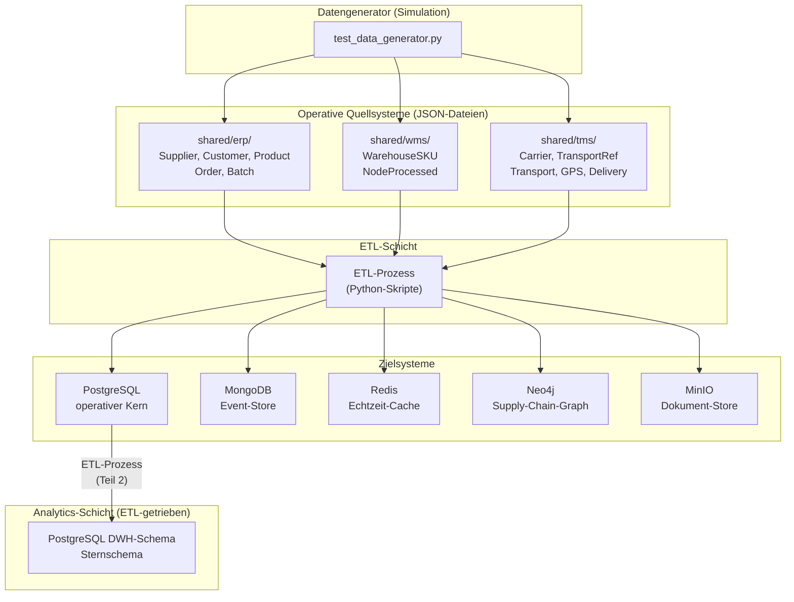

# Zielarchitektur – Banana Supply Chain Datenplattform

**Modul:** Datenmanagement und Analytics (M.Sc.), SoSe 26  
**Stand:** 2026-05-12

---

## 1. Architekturüberblick

Die Datenplattform der Banana Supply Chain besteht aus fünf Datenspeichersystemen, die jeweils für eine spezifische Datenkategorie und Nutzungscharakteristik ausgewählt wurden. Die Daten fließen vom Datengenerator (simuliert ERP, WMS, TMS) über JSON-Dateien in die jeweiligen Zielsysteme. Ein späterer ETL-Prozess überführt ausgewählte operative Daten in das Data Warehouse.

---

## 2. Architekturdiagramm



---

## 3. Rolle jedes Datensystems

### 3.1 PostgreSQL – Operativer Datenkern

**Rolle:** Persistente, transaktionssichere Speicherung aller strukturierten Stamm- und Bewegungsdaten aus ERP, WMS und TMS.

**Enthält:**
- Schema `erp`: Lieferanten, Kunden, Produkte, Bestellungen, Bestellpositionen, Batches
- Schema `wms`: WMS-SKUs, Knotenverarbeitungen
- Schema `tms`: Carrier, Produktreferenzen, Shipments, GPS-Positionen, Transportabschlüsse, Lieferungen
- Schema `mdm`: Golden Records, Source-System-Mappings
- Schema `meta`: Metadatentabellen (Spalten, Skalenniveaus, Qualitätsregeln)
- Schema `dwh`: Data-Warehouse-Sternschema (ETL-getrieben)

**Warum PostgreSQL?**
- ACID-Konformität für Transaktionsdaten (Bestellungen dürfen nicht halb gespeichert werden)
- Referenzielle Integrität via Fremdschlüssel (Produkt muss Lieferant haben)
- Unterstützung mehrerer Schemas in einer Datenbankinstanz → klare Trennung ERP/WMS/TMS/MDM
- Standard-Abfragesprache SQL für alle operativen Auswertungen

**Nicht geeignet für:** GPS-Echtzeitdaten (hohe Schreibfrequenz), flexible Event-Strukturen (fixes Schema), Graphabfragen (JOIN-Kaskaden statt nativer Graph-Traversal)

---

### 3.2 MongoDB – Flexibler Event-Store

**Rolle:** Speicherung des vollständigen Lifecycle-Ereignisstroms für Shipments und Supply-Chain-Ereignisse.

**Enthält:**
- Collection `shipment_events`: Vollständiger Event-Stream pro Shipment (Started, PositionUpdated, Completed, Delivered)
- Collection `node_events`: Knotenverarbeitungsereignisse mit Temperaturhistorie
- Collection `transport_events`: Detaillierte Transportdokumente mit eingebetteten Carrier-Infos
- Collection `batch_tracking`: Batch-Bewegungshistorie durch alle Knoten

**Warum MongoDB?**
- Shipment-Events haben **unterschiedliche Strukturen** (GPS-Event hat Koordinaten, Delivery-Event hat Empfänger) – ein fixes relationales Schema würde viele NULL-Spalten erzeugen
- **Dokumenten-Modell** erlaubt, den gesamten Event-Stream eines Shipments als ein Dokument zu speichern
- **Schema-Flexibilität** für zukünftige Erweiterungen (z. B. neue Sensortypen)
- Hohe Schreibleistung für Event-Streams

**Nicht geeignet für:** Stammdaten mit festen Beziehungen, Echtzeitabfragen mit µs-Latenz, komplexe Graphabfragen

---

### 3.3 Redis – Echtzeit-Cache

**Rolle:** Zwischenspeicher für den aktuellen Status, Position und Metriken von aktiven Sendungen und Systemzuständen.

**Enthält:**
- Aktueller Shipmentstatus pro `shipment_identifier`
- Letzte bekannte GPS-Position pro Shipment
- Aktueller Orderstatus
- Systemzähler (Gesamtbestellungen, aktive Transporte)
- Cache für häufig abgefragte Stammdaten (z. B. Produktnamen)

**Warum Redis?**
- **In-Memory**: Sub-Millisekunden-Latenz für Status-Abfragen (z. B. Dashboard-Refresh)
- **TTL (Time-to-Live)**: Echtzeitdaten wie GPS-Positionen verfallen automatisch nach kurzer Zeit
- Nicht gedacht für persistente Langzeitspeicherung → Redis ergänzt MongoDB, ersetzt es nicht
- **Atomic Counters**: `INCR`-Operationen für Statistiken ohne Datenbanklock

**Nicht geeignet für:** Historische Daten, komplexe Abfragen, große Datenvolumen (RAM-begrenzt auf 256 MB lt. docker-compose)

---

### 3.4 Neo4j – Supply-Chain-Graph

**Rolle:** Graphmodellierung der Supply-Chain-Topologie und Beziehungen zwischen allen beteiligten Entitäten.

**Enthält:**
- Nodes: `Supplier`, `Product`, `SupplyChainNode`, `Carrier`, `Customer`, `Shipment`, `Batch`
- Beziehungen: `SUPPLIES`, `CONTAINS`, `TRANSPORTED_VIA`, `TRANSPORTED_TO`, `DELIVERED_TO`, `CONNECTED_TO`, `PROCESSES`

**Warum Neo4j?**
- **Pfadanalysen**: "Über welche Knoten ist Produkt BAN-101 von Ghana nach Hamburg transportiert worden?" – in SQL: 6+ JOINs; in Cypher: eine Pattern-Query
- **Engpassanalyse**: Welcher Supply-Chain-Knoten hat die meisten Verzögerungen?
- **Netzwerkanalyse**: Welche Carrier transportieren auf welchen Routen?
- Relationale Datenbanken sind für tiefe, variable Graphabfragen nicht optimiert

**Nicht geeignet für:** Massentransaktionen, strukturierte Stammdatenpflege, Echtzeitdaten

---

### 3.5 MinIO – Dokumenten-Object-Store

**Rolle:** S3-kompatibler Objektspeicher für unstrukturierte Dokumente wie Lieferscheine, Rechnungen und Transportdokumente.

**Enthält:**
- Bucket `invoices`: Rechnungen pro Bestellung (PDF)
- Bucket `delivery-notes`: Lieferscheine pro Shipment (PDF)
- Bucket `transport-docs`: Frachtbriefe, Zolldokumente (PDF)
- Bucket `batch-certificates`: Qualitätszertifikate pro Batch (PDF)

**Warum MinIO?**
- **Binäre Dokumente** (PDF, Bilder) gehören **nicht** in eine relationale Datenbank – sie würden die Performance drastisch verschlechtern (BLOB-Speicher ist teuer)
- S3-kompatibler API-Standard ermöglicht spätere Migration zu AWS S3 ohne Code-Änderungen
- Metadaten (Dateiname, Größe, Erstelldatum) werden in MinIO als Object-Tags gespeichert
- PostgreSQL speichert nur die **Referenz** (Bucket + Objektname), nicht die Datei selbst

**Nicht geeignet für:** Strukturierte Daten, Abfragen über Dokumentinhalte, Echtzeitdaten

---

## 4. Datenfluss: Von der Simulation zu den Zielsystemen

### Phase 1: Datenerzeugung
```
test_data_generator.py
   → shared/erp/  (50 JSON-Dateien: Stammdaten + Orders + Batches)
   → shared/wms/  (70 JSON-Dateien: SKUs + Knotenverarbeitungen)
   → shared/tms/  (257 JSON-Dateien: Carrier + Transporte + GPS + Lieferungen)
```

### Phase 2: ETL-Verarbeitung (Extract → Transform → Load)

**Extract:** Python-Skripte lesen alle JSON-Dateien aus `shared/erp/`, `shared/wms/`, `shared/tms/`

**Transform:**
- Stammdaten → MDM-Schlüsselharmonisierung (`BAN-101` / `BAN_101` / `ban-101` → Golden Record)
- Bewegungsdaten → Normalisierung, Typ-Konvertierung, Validierung
- GPS-Events → Direkt in Redis (aktueller Status) + MongoDB (Archiv)
- Dokumente → PDF-Erzeugung, Upload nach MinIO

**Load:**
- Strukturierte Daten → PostgreSQL (ERP/WMS/TMS-Schemas)
- Event-Streams → MongoDB Collections
- Echtzeitzustände → Redis Keys
- Graph-Relationen → Neo4j Nodes + Edges
- Dokumente → MinIO Buckets

### Phase 3: DWH (nur über ETL, nicht direkt)
```
PostgreSQL (erp.orders + wms.node_processings + tms.deliveries)
   → ETL-Prozess (Teil 2)
   → PostgreSQL (dwh.fact_fulfillment + dwh.dim_*)
```

> **Wichtig:** ERP, WMS und TMS sind operative Quellsysteme. Das DWH-Schema wird ausschließlich durch ETL-Prozesse befüllt – es gibt **keine direkte Verbindung** zwischen operativen Schemas und dem DWH. Diese Trennung ist architektonisch essentiell.

---

## 5. Datenbankzuordnung: Vollständige Übersicht

| Eventtyp | Primäres Zielsystem | Begründung |
|---|---|---|
| SupplierCreated | PostgreSQL `erp` | Strukturierte Stammdaten, FK-Referenz |
| CustomerCreated | PostgreSQL `erp` | Strukturierte Stammdaten, FK-Referenz |
| ProductCreated | PostgreSQL `erp` + MDM | Stammdaten + Schlüsselharmonisierung |
| OrderCreated | PostgreSQL `erp` | Transaktionale Bewegungsdaten, ACID |
| BatchHarvested | PostgreSQL `erp` | Operative Bewegungsdaten |
| WarehouseSKUCreated | PostgreSQL `wms` + MDM | Stammdaten + Key-Mapping |
| NodeProcessed | PostgreSQL `wms` | Bewegungsdaten, strukturiert |
| CarrierCreated | PostgreSQL `tms` | Strukturierte Stammdaten |
| TransportProductReferenceCreated | PostgreSQL `tms` + MDM | Stammdaten + Key-Mapping |
| TransportStarted | PostgreSQL `tms` + MongoDB | Strukturiert + Event-Stream |
| **ShipmentPositionUpdated** | **Redis + MongoDB** | **Echtzeit + Archiv** |
| TransportCompleted | PostgreSQL `tms` + MongoDB | Strukturiert + Event-Stream |
| DeliveryCompleted | PostgreSQL `tms` + MongoDB | Strukturiert + Event-Stream |
| Lieferscheine / Rechnungen | MinIO | Binäre Dokumente |
| Supply-Chain-Graph | Neo4j | Graphabfragen, Netzwerkanalyse |
| Fulfillment-Kennzahlen | PostgreSQL `dwh` | Analytics-Schema (via ETL) |
