# ER-Modell – Banana Supply Chain (ERP / WMS / TMS)

**Modul:** Datenmanagement und Analytics (M.Sc.), SoSe 26  
**Stand:** 2026-05-12  
**Grundlage:** SQL-Schemata in `sql/02_create_erp_tables.sql`, `sql/03_create_wms_tables.sql`, `sql/04_create_tms_tables.sql`

---

## 1. ER-Diagramm (Mermaid)

```mermaid
erDiagram

    %% =========================================
    %% ERP-SCHEMA
    %% =========================================

    ERP_SUPPLIERS {
        int     supplier_id     PK
        varchar supplier_code   UK  "z.B. SUP-101"
        varchar supplier_name
        varchar country
        ts      created_at
    }

    ERP_PRODUCTS {
        int     product_id      PK
        varchar product_code    UK  "z.B. BAN-101 (kanonisch)"
        varchar product_name
        varchar category
        int     supplier_id     FK
        ts      created_at
    }

    ERP_CUSTOMERS {
        int     customer_id     PK
        varchar customer_number UK  "z.B. CUST-101"
        varchar customer_name
        varchar city
        varchar country
        ts      created_at
    }

    ERP_ORDERS {
        int     order_id            PK
        varchar order_reference     UK  "ORD-<uuid>"
        int     customer_id         FK
        varchar delivery_priority       "HIGH / NORMAL / LOW"
        ts      order_timestamp
        ts      created_at
    }

    ERP_ORDER_ITEMS {
        int         item_id     PK
        int         order_id    FK
        int         product_id  FK
        int         quantity
        numeric     unit_price
        ts          created_at
    }

    ERP_BATCHES {
        int     batch_id            PK
        varchar batch_identifier    UK  "BATCH-<uuid>"
        int     product_id          FK
        varchar origin_country
        int     quantity
        varchar supply_chain_node
        varchar wms_sku                 "BAN_108 (WMS-Format)"
        varchar tms_product_reference   "ban-108 (TMS-Format)"
        ts      harvested_at
    }

    ERP_DOCUMENT_REFERENCES {
        int     ref_id          PK
        varchar entity_type         "orders / deliveries / batches"
        varchar entity_key      UK  "Referenzierter Business Key"
        varchar document_type       "INVOICE / DELIVERY_NOTE etc."
        varchar bucket              "MinIO-Bucket-Name"
        varchar object_path         "MinIO-Objektpfad"
        ts      created_at
    }

    %% =========================================
    %% WMS-SCHEMA
    %% =========================================

    WMS_WAREHOUSE_SKUS {
        int     sku_id              PK
        varchar erp_product_code    UK  "BAN-101 (Cross-Ref zu ERP)"
        varchar sku                 UK  "BAN_101 (WMS-Format)"
        ts      created_at
    }

    WMS_SUPPLY_CHAIN_NODES {
        int     node_id         PK
        varchar node_code       UK  "BANANA_PLANTATION etc."
        varchar node_name
        varchar node_type           "PLANTATION / COLD_STORAGE / etc."
        varchar region
        int     sequence_order      "1-7"
        ts      created_at
    }

    WMS_NODE_PROCESSINGS {
        int     processing_id   PK
        int     node_id         FK
        varchar batch_reference     "→ erp.batches.batch_identifier"
        varchar sku                 "BAN_108"
        numeric temperature         "Kühlkette: 10-15°C"
        varchar status              "COMPLETED / PENDING / FAILED"
        ts      processed_at
    }

    %% =========================================
    %% TMS-SCHEMA
    %% =========================================

    TMS_CARRIERS {
        int     carrier_id      PK
        varchar carrier_code    UK  "CAR-101"
        varchar carrier_name
        ts      created_at
    }

    TMS_TRANSPORT_PRODUCT_REFS {
        int     ref_id                      PK
        varchar erp_product_code            UK  "BAN-101 (Cross-Ref)"
        varchar transport_product_reference UK  "ban-101 (TMS-Format)"
        ts      created_at
    }

    TMS_SHIPMENTS {
        int     shipment_id             PK
        varchar shipment_identifier     UK  "SHIP-<uuid>"
        varchar source_node
        varchar target_node
        varchar transport_mode              "TRUCK / SEA_FREIGHT"
        varchar cargo_product_reference     "ban-108"
        int     carrier_id              FK
        ts      estimated_arrival
        ts      started_at
    }

    TMS_SHIPMENT_POSITIONS {
        int     position_id             PK
        int     shipment_id             FK
        numeric latitude
        numeric longitude
        numeric container_temperature
        numeric speed_kmh
        ts      recorded_at
    }

    TMS_TRANSPORT_COMPLETIONS {
        int     completion_id   PK
        int     shipment_id     FK
        varchar arrival_node
        int     delay_minutes
        ts      completed_at
    }

    TMS_DELIVERIES {
        int     delivery_id             PK
        int     shipment_id             FK
        varchar supply_chain_node           "RETAIL_STORE"
        varchar delivery_status             "SUCCESSFUL / DELAYED / FAILED"
        varchar received_by
        varchar cargo_product_reference
        ts      delivered_at
    }

    %% =========================================
    %% BEZIEHUNGEN – ERP
    %% =========================================

    ERP_SUPPLIERS    ||--o{ ERP_PRODUCTS      : "liefert"
    ERP_CUSTOMERS    ||--o{ ERP_ORDERS        : "gibt auf"
    ERP_ORDERS       ||--o{ ERP_ORDER_ITEMS   : "enthält"
    ERP_PRODUCTS     ||--o{ ERP_ORDER_ITEMS   : "enthalten in"
    ERP_PRODUCTS     ||--o{ ERP_BATCHES       : "wird geerntet als"

    ERP_ORDERS       ||--o{ ERP_DOCUMENT_REFERENCES  : "hat Dokumente"
    ERP_BATCHES      ||--o{ ERP_DOCUMENT_REFERENCES  : "hat Dokumente"

    %% =========================================
    %% BEZIEHUNGEN – WMS
    %% =========================================

    WMS_SUPPLY_CHAIN_NODES ||--o{ WMS_NODE_PROCESSINGS : "verarbeitet"

    %% =========================================
    %% BEZIEHUNGEN – TMS
    %% =========================================

    TMS_CARRIERS     ||--o{ TMS_SHIPMENTS             : "transportiert"
    TMS_SHIPMENTS    ||--o{ TMS_SHIPMENT_POSITIONS     : "hat Positionen"
    TMS_SHIPMENTS    ||--o| TMS_TRANSPORT_COMPLETIONS  : "wird abgeschlossen durch"
    TMS_SHIPMENTS    ||--o| TMS_DELIVERIES             : "endet in Lieferung"
```

---

## 2. Erläuterung der wichtigsten Beziehungen

### 2.1 ERP: Lieferant → Produkt (1:N)

Ein Lieferant (`erp.suppliers`) kann mehrere Produkte (`erp.products`) liefern. Jedes Produkt gehört zu **genau einem** Lieferanten (Pflicht-FK). In den Daten liefern z. B. verschiedene ghanaische Plantagen unterschiedliche Bananensorten.

**Kardinalität:** `1 Supplier : N Products`

---

### 2.2 ERP: Kunde → Bestellung (1:N)

Ein Kunde (`erp.customers`) kann mehrere Bestellungen (`erp.orders`) aufgeben. Jede Bestellung gehört zu **genau einem** Kunden. In der Banana Supply Chain sind Kunden Einzelhandelsketten (ALDI, LIDL etc.).

**Kardinalität:** `1 Customer : N Orders`

---

### 2.3 ERP: Bestellung → Positionen → Produkte (M:N über Zwischentabelle)

Eine Bestellung (`erp.orders`) kann mehrere Produkte enthalten. Ein Produkt kann in mehreren Bestellungen vorkommen. Diese M:N-Beziehung wird durch `erp.order_items` aufgelöst, die zusätzlich `quantity` und `unit_price` als Beziehungsattribute trägt.

**Kardinalität:** `N Orders : M Products` (über `erp.order_items`)

---

### 2.4 ERP: Produkt → Batch (1:N)

Ein `erp.batch` entsteht aus einem Ernte-Event (`BatchHarvested`) und ist einem `erp.product` zugeordnet. **Kein Fremdschlüssel zu `erp.orders`:** Das `BatchHarvested`-Event enthält keine Bestellreferenz; die Verbindung zwischen Batch und Bestellung wird indirekt über `erp.order_items` (product_id) hergestellt, nicht als DB-FK. Der Batch trägt sowohl den ERP-Produktcode als auch WMS-SKU und TMS-Produktreferenz – er ist damit das **verbindende Masterdaten-Element** der gesamten Supply Chain.

**Kardinalität:** `1 Product : N Batches`

---

### 2.5 WMS: Knoten → Knotenverarbeitung (1:N)

Jeder `wms.supply_chain_node` kann viele `wms.node_processings` haben – eine für jeden Batch, der ihn durchläuft. Die sieben Knoten der Supply Chain verarbeiten in jeder Iteration jeden Batch einmal.

**Kardinalität:** `1 Node : N NodeProcessings`

> **Cross-Schema-Beziehung:** `wms.node_processings.batch_reference` referenziert `erp.batches.batch_identifier`. Da dies eine Cross-Schema-Referenz ist, wird sie nicht als PostgreSQL-FK deklariert, sondern durch ETL-Validierung sichergestellt.

---

### 2.6 TMS: Carrier → Shipment (1:N)

Ein Carrier (`tms.carriers`) führt viele Transporte (`tms.shipments`) durch. Jedes Shipment hat genau einen Carrier. In der Seefracht (Afrika→Europa) werden Maersk, MSC oder Hapag Lloyd eingesetzt; im Landtransport DHL oder DB Schenker.

**Kardinalität:** `1 Carrier : N Shipments`

---

### 2.7 TMS: Shipment → Positions → Completions → Deliveries

Ein Shipment (`tms.shipments`) hat einen vollständigen Lifecycle:
- 1-3 GPS-Positionen (`tms.shipment_positions`)
- Genau **einen** Transportabschluss (`tms.transport_completions`) mit `delay_minutes`
- Optional **eine** Lieferung (`tms.deliveries`) – nur für Transporte zum `RETAIL_STORE`

**Kardinalität:** 
- `1 Shipment : 1–3 Positions`
- `1 Shipment : 1 Completion`
- `1 Shipment : 0–1 Delivery`

---

### 2.8 ERP: Document References (polymorphe MinIO-Verknüpfung)

`erp.document_references` speichert keine Dokumente selbst, sondern nur die MinIO-Pfade (Bucket + Objektpfad). Die Tabelle ist **polymorph**: `entity_type` gibt an, auf welchen Entitätstyp sich der Eintrag bezieht (`orders`, `deliveries`, `batches`), `entity_key` enthält den jeweiligen Business Key (z. B. `ORD-<uuid>` oder `BATCH-<uuid>`).

**Kardinalität:** `1 Order/Batch : 0–N DocumentReferences`

> Diese polymorphe Verknüpfung ist in Mermaid nur mit logischen Beziehungen darstellbar, da PostgreSQL selbst keinen FK auf `entity_key` definiert.

---

## 3. Cross-Schema-Beziehungen (logisch, kein DB-FK)

Diese Beziehungen bestehen fachlich, sind aber aus Architekturgrün­den nicht als PostgreSQL-Fremdschlüssel deklariert (Cross-Schema-Referenzen würden Schema-Abhängigkeiten erzeugen, die Deployments erschweren):

| Von | Feld | Zu | Typ |
|---|---|---|---|
| `wms.node_processings` | `batch_reference` | `erp.batches.batch_identifier` | Logische Referenz |
| `wms.warehouse_skus` | `erp_product_code` | `erp.products.product_code` | Logische Referenz |
| `tms.transport_product_references` | `erp_product_code` | `erp.products.product_code` | Logische Referenz |
| `tms.shipments` | `cargo_product_reference` | `tms.transport_product_references` | Logische Referenz |
| `erp.batches` | `wms_sku` | `wms.warehouse_skus.sku` | Redundant via MDM |
| `erp.document_references` | `entity_key` | `erp.orders.order_reference` / `erp.batches.batch_identifier` | polymorphe Referenz (kein FK) |

Diese Cross-Referenzen werden durch das **MDM-Schema** harmonisiert (siehe `docs/04_masterdata_management.md`).

---

## 4. Normalisierungsstufe

Alle Tabellen sind in der **3. Normalform (3NF)**:
- **1NF:** Alle Attribute atomar (keine Arrays; items[] aus OrderCreated wurde in `order_items` normalisiert)
- **2NF:** Alle Nicht-Schlüsselattribute hängen vom vollständigen Primärschlüssel ab
- **3NF:** Keine transitiven Abhängigkeiten (z. B. `customer_city` liegt in `customers`, nicht in `orders`)

> **Annahme:** Der eingebettete Customer-Snapshot im OrderCreated-Event wird beim ETL-Load aufgelöst: `order.customer.customer_number` wird zu einem FK auf `erp.customers.customer_id`.
