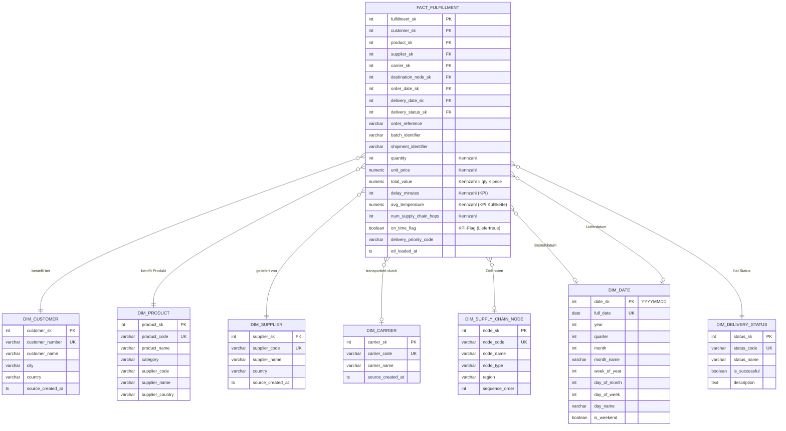

# Data Warehouse Modell – Banana Supply Chain

**Modul:** Datenmanagement und Analytics (M.Sc.), SoSe 26  
**Stand:** 2026-05-14  
**SQL-Implementierung:** `sql/07_create_dwh_schema.sql`  
**ETL-Implementierung:** `bananasupplychain/etl_dwh.py`

---

## 1. Abgrenzung: Operative Systeme vs. Data Warehouse

| Aspekt | ERP/WMS/TMS-Schemas | DWH-Schema |
|---|---|---|
| **Zweck** | Operative Datenhaltung | Analytische Auswertungen |
| **Schreibzugriff** | ETL, operative Systeme | **Nur ETL-Prozesse** |
| **Normalisierung** | 3NF (normalisiert) | Denormalisiert (Sternschema) |
| **Optimiert für** | Schreiboperationen (OLTP) | Leseoperationen (OLAP) |
| **Zeitbezug** | Aktuelle operative Daten | Historische Daten, Zeitreihen |
| **Transaktionen** | Ja (ACID) | Nein (Bulk-Load per ETL) |

ERP-, WMS- und TMS-Schemas sind **Quellsysteme**. Das DWH-Schema entsteht **erst durch ETL-Prozesse** (Phase 2, `etl_dwh.py`). Es gibt keine Trigger, Fremdschlüssel oder direkte Verbindungen zwischen operativen Schemas und dem DWH-Schema.

---

## 2. Sternschema-Diagramm



---

## 3. Faktentabelle: `dwh.fact_fulfillment`

### Grain (Granularität)

**Eine Zeile = Eine abgeschlossene Endlieferung** (`DeliveryCompleted` an `RETAIL_STORE`).

Bei 10 abgeschlossenen Orders ergibt das **10 Faktenzeilen** (1 pro Order/Batch/Delivery):

```
1 OrderCreated → 1 BatchHarvested → 6 Transportetappen → 1 DeliveryCompleted
                                                          ↑
                                                   Grain dieser Tabelle
```

Jede Fact-Zeile trägt die vollständigen Finanzkennzahlen der zugehörigen Bestellung (`quantity`, `unit_price`, `total_value`). Zwischentransporte (Plantation→Collection→…→Central Warehouse) sind nicht als eigene Fact-Zeilen abgebildet — für Hop-Level-Analysen (Carrier-Performance pro Etappe) steht `tms.shipments` direkt zur Verfügung.

Diese Granularität stellt sicher, dass `SUM(total_value)` den tatsächlichen Gesamtumsatz liefert und KPIs wie `kpi_total_revenue_eur` korrekt berechnet werden.

### Kennzahlen (Measures)

| Kennzahl | Datentyp | Beschreibung | Skalenniveau | Analytics-Verwendung |
|---|---|---|---|---|
| `quantity` | INT | Bestellmenge in Einheiten | RATIO | Gesamtmenge pro Produkt/Kunde/Monat |
| `unit_price` | NUMERIC(10,2) | Einzelpreis in EUR | RATIO | Preisanalyse, Durchschnittspreise |
| `total_value` | NUMERIC(12,2) | Gesamtwert (qty × price) | RATIO | Umsatz pro Carrier/Kunde/Monat |
| `delay_minutes` | INT | Gesamtverzögerung der Endlieferung in Minuten | RATIO | On-Time-Delivery-Rate, Carrier-Performance |
| `avg_temperature` | NUMERIC(5,2) | Ø Containertemperatur über alle Knotenverarbeitungen des Batches | INTERVAL | Kühlketten-Compliance (10–15 °C) |
| `num_supply_chain_hops` | INT | Anzahl Transportetappen der Supply Chain (Konstante: 6) | RATIO | Prozessanalyse, Abweichungserkennung |
| `on_time_flag` | BOOLEAN | TRUE = SUCCESSFUL + delay_minutes = 0 | NOMINAL | Direktes Liefertreue-Flag für PowerBI |

`on_time_flag` ist ein abgeleitetes KPI-Flag, das im ETL aus `delivery_status` und `delay_minutes` berechnet wird. Da `fact_fulfillment` ausschließlich Endlieferungen enthält, ist `on_time_flag` für jede Zeile eindeutig bestimmbar (kein `NULL` durch `IN_TRANSIT`-Zeilen).

---

## 4. Dimensionstabellen im Überblick

### `dwh.dim_customer`
Kundenstammdaten (ALDI, LIDL, REWE u. a.) denormalisiert für Slicing nach Kunde, Stadt, Land.  
**Quelle:** `erp.customers` via ETL.  
**Business Key:** `customer_number` (Format: CUST-101).

### `dwh.dim_product`
Produktstammdaten **inklusive** denormalisierter Lieferantenattribute (`supplier_name`, `supplier_country`). Diese Denormalisierung reduziert JOINs bei Produkt-Lieferant-Abfragen.  
**Quelle:** `erp.products` JOIN `erp.suppliers` via ETL.  
**Business Key:** `product_code` (Format: BAN-101).

### `dwh.dim_supplier`
Separate Lieferanten-Dimension für eigenständige Lieferantenanalysen (z. B. Clusteranalyse der Lieferanten in Teil 2).  
**Quelle:** `erp.suppliers` via ETL.  
**Business Key:** `supplier_code` (Format: SUP-101).

### `dwh.dim_carrier`
Transportdienstleister für Carrier-Performance-Analysen (Verzögerungsraten, OTD-Rate).  
**Quelle:** `tms.carriers` via ETL.  
**Business Key:** `carrier_code` (Format: CAR-101).

### `dwh.dim_supply_chain_node`
Alle 7 Supply-Chain-Knoten mit `sequence_order` (1 = Plantation, 7 = Retail Store) für Prozessanalysen (welcher Knoten verursacht die meisten Verzögerungen).  
**Quelle:** `wms.supply_chain_nodes` via ETL.  
**Business Key:** `node_code` (z. B. BANANA_PLANTATION).

### `dwh.dim_date`
Vorab befüllte Datums-Dimension (2025-01-01 bis 2027-12-31, **1095 Zeilen**) mit Jahr, Quartal, Monat, Kalenderwochen-Nr., Wochentag, Wochenende-Flag. Ermöglicht Zeitreihenanalysen ohne SQL-Datumsfunktionen.  
**Quelle:** Generiert via `GENERATE_SERIES` (keine operative Quelle).  
**Surrogate Key:** `date_sk` im Format YYYYMMDD (z. B. 20260512).

### `dwh.dim_delivery_status`
Kleine Lookup-Tabelle mit 4 Werten: SUCCESSFUL, DELAYED, FAILED, IN_TRANSIT. Das Flag `is_successful` vereinfacht Erfolgs-/Misserfolgs-Aggregationen.  
**Quelle:** Statisch (Werte sind systemdefiniert, kein ETL nötig).

---

## 5. ETL-Übergänge: Operative Schemas → DWH

### Architektur

```
etl_load.py (Phase 1)          etl_dwh.py (Phase 2)
─────────────────────          ─────────────────────
JSON-Events                    erp.* / wms.* / tms.*
    │                                    │
    ▼                                    ▼
erp.*, wms.*, tms.*       →    dwh.dim_* (idempotent, ON CONFLICT DO NOTHING)
                          →    dwh.fact_fulfillment (DELETE + INSERT)
```

### Quell-Ziel-Mapping

| Quelle (operativ) | Transformation | Ziel (DWH) |
|---|---|---|
| `erp.customers` | Direkte Kopie | `dim_customer` |
| `erp.suppliers` | Direkte Kopie | `dim_supplier` |
| `erp.products` JOIN `erp.suppliers` | Denormalisierung: Lieferantenattribute in Produktzeile einfügen | `dim_product` |
| `tms.carriers` | Direkte Kopie | `dim_carrier` |
| `wms.supply_chain_nodes` | Direkte Kopie | `dim_supply_chain_node` |
| `tms.shipments` | Grain: 1 Zeile pro Endlieferung (INNER JOIN tms.deliveries) | `fact_fulfillment` |
| `tms.deliveries` | JOIN auf shipment_id → `delivery_status`, `delivered_at` | `fact_fulfillment.delivery_status_sk` |
| `tms.transport_completions` | JOIN auf shipment_id → `delay_minutes` | `fact_fulfillment.delay_minutes` |
| `wms.node_processings` | AVG(temperature) pro Produktcode | `fact_fulfillment.avg_temperature` |
| `erp.orders` + `erp.order_items` | JOIN über product_code → Bestellwert | `fact_fulfillment.quantity / unit_price / total_value` |
| Berechnet | `delivery_status = 'SUCCESSFUL' AND delay_minutes = 0` | `fact_fulfillment.on_time_flag` |

### Idempotenz

- **Dimensionen:** `ON CONFLICT (business_key) DO NOTHING` – mehrfache Ausführung sicher.
- **Faktentabelle:** `DELETE FROM dwh.fact_fulfillment` vor jedem Lauf, dann Neubeladung – deterministisch reproduzierbar.

### MDM-Schlüsselharmonisierung im ETL

Produkt-Schlüssel kommen in drei Formaten vor:

| System | Format | Beispiel |
|---|---|---|
| ERP | BAN-101 | `cargo_product_reference` in TMS muss auf ERP-Format zurückgeführt werden |
| WMS | BAN_101 | `sku` in `warehouse_skus` |
| TMS | ban-101 | `cargo_product_reference` in `tms.shipments` |

`etl_load.py` normalisiert alle Schlüssel beim Laden in die operativen Schemas auf das ERP-Format (BAN-101). Das DWH-ETL nutzt daher bereits harmonisierte Schlüssel und benötigt keine zusätzliche MDM-Auflösung.

---

## 6. Analytische Views

Drei vorberechnete Views liegen im `dwh`-Schema. Sie dienen als direkte Datenquelle für PowerBI-Visuals und Python-Charts.

### `dwh.v_carrier_performance`
**Grain:** 1 Zeile pro Carrier  
**Felder:** `carrier_code`, `carrier_name`, `total_hops`, `on_time_count`, `delayed_count`, `otd_rate_pct`, `avg_delay_minutes`, `max_delay_minutes`  
**Verwendung:** PowerBI KPI-Card „OTD-Rate", Python-Histogramm „Verzögerungen nach Carrier"

### `dwh.v_kpi_summary`
**Grain:** 1 Zeile (Gesamtaggregat)  
**Felder:** Alle 5 Pflicht-KPIs direkt als Spalten (Liefertreue, Ø Verzögerung, Temperaturausreißer-Quote, Ø Bestellwert, Gesamtumsatz)  
**Verwendung:** PowerBI KPI-Cards, Ergebnis-Tabelle im Abschlussbericht

### `dwh.v_monthly_revenue`
**Grain:** 1 Zeile pro Produkt und Monat  
**Felder:** `year`, `month`, `product_code`, `total_quantity`, `total_revenue_eur`, `num_shipments`  
**Verwendung:** Python Absatzprognose (ARIMA/Prophet), PowerBI Zeitreihen-Liniendiagramm

---

## 7. Beispielabfragen

### Gesamtumsatz pro Kunde und Monat
```sql
SELECT c.customer_name, d.year, d.month, SUM(f.total_value) AS umsatz_eur
FROM   dwh.fact_fulfillment f
JOIN   dwh.dim_customer     c ON c.customer_sk = f.customer_sk
JOIN   dwh.dim_date         d ON d.date_sk     = f.order_date_sk
GROUP  BY c.customer_name, d.year, d.month
ORDER  BY d.year, d.month;
```

### On-Time-Delivery-Rate pro Carrier (via View)
```sql
SELECT carrier_name, otd_rate_pct, avg_delay_minutes
FROM   dwh.v_carrier_performance
ORDER  BY otd_rate_pct DESC;
```

### Alle 5 Pflicht-KPIs in einer Abfrage
```sql
SELECT * FROM dwh.v_kpi_summary;
```

### Temperaturauffälligkeiten pro Supply-Chain-Knoten
```sql
SELECT n.node_name, n.sequence_order,
       ROUND(AVG(f.avg_temperature), 2)  AS avg_temp,
       COUNT(CASE WHEN f.avg_temperature NOT BETWEEN 10 AND 15 THEN 1 END) AS kuehlketten_brueche
FROM   dwh.fact_fulfillment        f
JOIN   dwh.dim_supply_chain_node   n ON n.node_sk = f.destination_node_sk
WHERE  f.avg_temperature IS NOT NULL
GROUP  BY n.node_name, n.sequence_order
ORDER  BY n.sequence_order;
```

### Monatliche Mengenzeitreihe (Basis für Absatzprognose)
```sql
SELECT year, month, product_code, total_quantity
FROM   dwh.v_monthly_revenue
ORDER  BY product_code, year, month;
```

---

## 8. PowerBI-Anbindung

**Datenquelle:** PostgreSQL DWH-Schema (`dwh.*`) via Import-Modus  
**Verbindungsparameter:**
- Host: `localhost:5432`
- Datenbank: `logistics`
- Schema: `dwh`
- User: `user` / Passwort: `password`

**Empfohlene Tabellen / Views für Import:**

| PowerBI-Visual | Datenquelle |
|---|---|
| KPI-Cards (Liefertreue, Umsatz, Temperatur) | `dwh.v_kpi_summary` |
| Carrier-Performance-Balkendiagramm | `dwh.v_carrier_performance` |
| Zeitreihen-Liniendiagramm (Umsatz/Monat) | `dwh.v_monthly_revenue` |
| Detailtabelle aller Fulfillments | `dwh.fact_fulfillment` + alle `dim_*` |
| Slicer: Datum | `dwh.dim_date` (Felder: year, month, quarter) |
| Slicer: Carrier / Produkt / Kunde | `dwh.dim_carrier`, `dwh.dim_product`, `dwh.dim_customer` |

**Hinweis:** Der Import-Modus eignet sich bei 60–1095 Zeilen optimal (kein DirectQuery-Overhead). PowerBI cached die Daten lokal; nach jedem ETL Phase 2 Lauf muss manuell aktualisiert werden.

---

## 9. Prüfqueries (Nachweis)

```sql
-- Dimensionen und Fakten
SELECT COUNT(*) FROM dwh.dim_customer;           -- erwartet: 10
SELECT COUNT(*) FROM dwh.dim_supplier;           -- erwartet: 10
SELECT COUNT(*) FROM dwh.dim_product;            -- erwartet: 10
SELECT COUNT(*) FROM dwh.dim_carrier;            -- erwartet:  5
SELECT COUNT(*) FROM dwh.dim_supply_chain_node;  -- erwartet:  7
SELECT COUNT(*) FROM dwh.dim_date;               -- erwartet: 1095
SELECT COUNT(*) FROM dwh.dim_delivery_status;    -- erwartet:  4
SELECT COUNT(*) FROM dwh.fact_fulfillment;       -- erwartet: 10 (1 Endlieferung pro Order/Batch)

-- KPI-Übersicht
SELECT * FROM dwh.v_kpi_summary;

-- Carrier-Performance
SELECT * FROM dwh.v_carrier_performance ORDER BY otd_rate_pct DESC;

-- on_time_flag: Anteil pünktlicher Hops
SELECT on_time_flag, COUNT(*) FROM dwh.fact_fulfillment GROUP BY on_time_flag;
```
