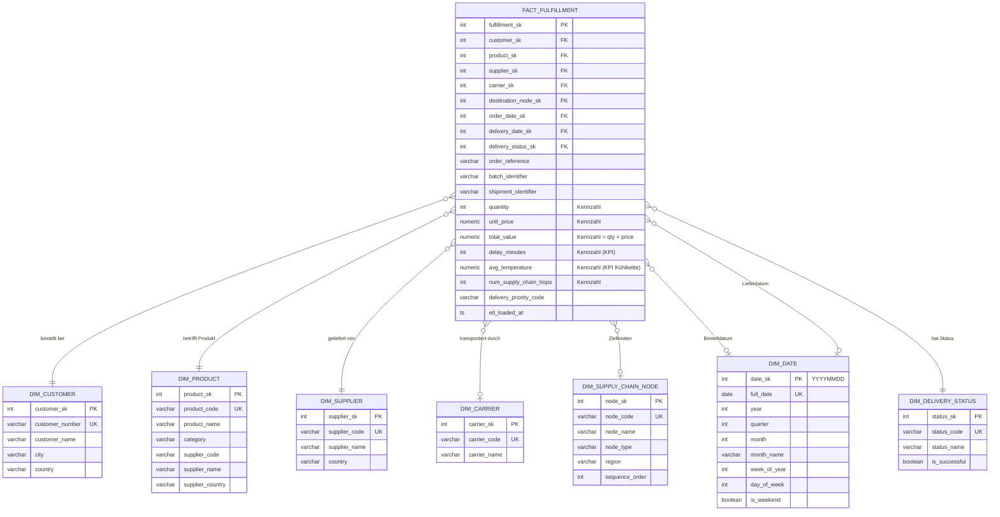

# Data Warehouse Modell – Banana Supply Chain

**Modul:** Datenmanagement und Analytics (M.Sc.), SoSe 26  
**Stand:** 2026-05-12  
**SQL-Implementierung:** `sql/07_create_dwh_schema.sql`

---

## 1. Abgrenzung: Operative Systeme vs. Data Warehouse

> **Wichtig für das Verständnis der Architektur:**

| Aspekt | ERP/WMS/TMS-Schemas | DWH-Schema |
|---|---|---|
| **Zweck** | Operative Datenhaltung | Analytische Auswertungen |
| **Schreibzugriff** | ETL, operative Systeme | **Nur ETL-Prozesse** |
| **Normalisierung** | 3NF (normalisiert) | Denormalisiert (Sternschema) |
| **Optimiert für** | Schreiboperationen (OLTP) | Leseoperationen (OLAP) |
| **Zeitbezug** | Aktuelle operative Daten | Historische Daten, Zeitreihen |

ERP-, WMS- und TMS-Schemas sind **Quellsysteme**. Das DWH-Schema entsteht **erst durch ETL-Prozesse**. Es gibt keine direkte Verbindung oder Trigger zwischen operativen Schemas und dem DWH.

---

## 2. Sternschema-Diagramm



---

## 3. Faktentabelle: `dwh.fact_fulfillment`

### Grain (Granularität)

**Eine Zeile = Ein Transport-Hop in der Lieferkette** (entspricht einem Datensatz in `tms.shipments`).

Bei 10 abgeschlossenen Endlieferungen entlang einer 6-stufigen Supply Chain (Plantation → Collection → Quality Control → Africa Cold Storage → Europe Cold Storage → Central Warehouse → Retail Store) ergeben sich **60 Faktenzeilen**:
- 10 Hops mit Endlieferungs-Status (`SUCCESSFUL` / `DELAYED` / `FAILED`)
- 50 Zwischenhops mit Status `IN_TRANSIT`

Verknüpfung:
- `shipment.cargo_product_reference == product.product_code` → Customer, Supplier, Order, Bestellwert
- `shipment.shipment_id → transport_completions` → `delay_minutes`
- `shipment.shipment_id → deliveries` → `delivery_status`, `delivered_at` (nur Endhops)
- `product.product_code → batches → node_processings` → `avg_temperature`

Diese Granularität ermöglicht **Hop-Level-Analytics**: Carrier-Performance pro Etappe, Verzögerungs-Heatmaps pro Knoten, Routenanalysen.

### Kennzahlen (Measures)

| Kennzahl | Datentyp | Beschreibung | Skalenniveau | Analytics-Verwendung |
|---|---|---|---|---|
| `quantity` | INT | Bestellmenge in Einheiten | RATIO | Gesamtmenge pro Produkt/Kunde/Monat |
| `unit_price` | NUMERIC(10,2) | Einzelpreis in EUR | RATIO | Preisanalyse, Durchschnittspreise |
| `total_value` | NUMERIC(12,2) | Gesamtwert (qty × price) | RATIO | Umsatz, Umsatz pro Carrier/Kunde/Monat |
| `delay_minutes` | INT | Verzögerung in Minuten | RATIO | On-Time-Delivery-Rate, Carrier-Performance |
| `avg_temperature` | NUMERIC(5,2) | Ø Temperatur über alle Knoten | INTERVAL | Kühlketten-Compliance, Qualitäts-KPI |
| `num_supply_chain_hops` | INT | Anzahl Knoten | RATIO | Prozessanalyse, Abweichungserkennung |

### Beispielhafte Analytics-Abfragen (Teil 2 vorbereitet)

```sql
-- Gesamtumsatz pro Kunde und Monat
SELECT c.customer_name, d.year, d.month, SUM(f.total_value) AS umsatz
FROM   dwh.fact_fulfillment f
JOIN   dwh.dim_customer     c ON c.customer_sk = f.customer_sk
JOIN   dwh.dim_date         d ON d.date_sk     = f.order_date_sk
GROUP  BY c.customer_name, d.year, d.month
ORDER  BY d.year, d.month;

-- On-Time-Delivery-Rate pro Carrier
SELECT ca.carrier_name,
       COUNT(*) AS total_lieferungen,
       SUM(CASE WHEN s.status_code = 'SUCCESSFUL' THEN 1 ELSE 0 END) AS erfolgreich,
       ROUND(100.0 * SUM(CASE WHEN s.status_code = 'SUCCESSFUL' THEN 1 ELSE 0 END) / COUNT(*), 1) AS otd_rate
FROM   dwh.fact_fulfillment    f
JOIN   dwh.dim_carrier         ca ON ca.carrier_sk    = f.carrier_sk
JOIN   dwh.dim_delivery_status s  ON s.status_sk      = f.delivery_status_sk
GROUP  BY ca.carrier_name;

-- Durchschnittliche Kühlkettentemperatur pro Produkt
SELECT p.product_name, ROUND(AVG(f.avg_temperature), 2) AS avg_temp
FROM   dwh.fact_fulfillment f
JOIN   dwh.dim_product      p ON p.product_sk = f.product_sk
WHERE  f.avg_temperature IS NOT NULL
GROUP  BY p.product_name
ORDER  BY avg_temp DESC;
```

---

## 4. Dimensionstabellen im Überblick

### `dwh.dim_customer`
Enthält alle Kundenstammdaten. Ermöglicht Analyse nach Kunde, Stadt, Land.  
**Quelle:** `erp.customers` via ETL.

### `dwh.dim_product`
Enthält Produktstammdaten **inklusive** denormalisierter Lieferantenattribute (`supplier_name`, `supplier_country`). Diese Denormalisierung reduziert JOINs in häufigen Abfragen (Produkt+Lieferant gleichzeitig).  
**Quelle:** `erp.products + erp.suppliers` via ETL.

### `dwh.dim_supplier`
Separates Lieferanten-Dimension für eigenständige Lieferantenanalysen (z. B. Clusteranalyse der Lieferanten in Teil 2).  
**Quelle:** `erp.suppliers` via ETL.

### `dwh.dim_carrier`
Transportdienstleister für Carrier-Performance-Analysen (Verzögerungsraten).  
**Quelle:** `tms.carriers` via ETL.

### `dwh.dim_supply_chain_node`
Alle 7 Supply-Chain-Knoten mit `sequence_order` für Prozessanalysen (welcher Knoten verursacht meiste Verzögerungen).  
**Quelle:** `wms.supply_chain_nodes` via ETL.

### `dwh.dim_date`
Vorab befüllte Datums-Dimension (2025-2027) mit Jahr, Quartal, Monat, Wochentag, Wochenende. Ermöglicht effiziente Zeitreihenanalysen ohne SQL-Datumsfunktionen.  
**Quelle:** Generiert via `GENERATE_SERIES` (keine operative Quelle nötig).

### `dwh.dim_delivery_status`
Kleine Lookup-Tabelle für SUCCESSFUL/DELAYED/FAILED mit `is_successful`-Flag.  
**Quelle:** Statisch (keine ETL-Quelle, da Werte fest definiert).

---

## 5. ETL-Befüllung der Faktentabelle

Die `fact_fulfillment` wird durch einen ETL-Prozess befüllt, der Daten aus mehreren operativen Schemas zusammenführt:

```
Quellen:
  erp.orders          → customer_sk, order_date_sk, delivery_priority_code
  erp.order_items     → quantity, unit_price, total_value
  erp.batches         → batch_identifier
  erp.products        → product_sk, supplier_sk
  tms.shipments       → carrier_sk, shipment_identifier
  tms.deliveries      → delivery_status_sk, delivery_date_sk
  tms.transport_completions → delay_minutes
  wms.node_processings → avg_temperature (aggregiert)
  wms.supply_chain_nodes → destination_node_sk

Transformationen:
  - MDM-Schlüsselharmonisierung (ban-101 → BAN-101 → product_sk)
  - Aggregation der Temperaturen (AVG über alle NodeProcessings)
  - Aggregation der Verzögerungen (SUM delay_minutes pro Fulfillment)
  - Lookup der Surrogate Keys (customer_number → customer_sk)
```

Erst nach vollständiger ETL-Befüllung stehen die Analytics-Abfragen (Teil 2) zur Verfügung.
