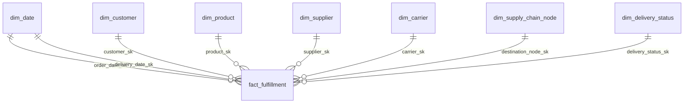

# Teil 2 – Analytics: PowerBI-Konzept

**Modul:** Datenmanagement und Analytics (M.Sc.), SoSe 26 – TH Lübeck
**Gruppe:** 7
**Aufgabe:** A-4 – PowerBI-Dashboard (Konzept)

Dieses Dokument beschreibt das PowerBI-Dashboard als **umsetzungsreifes
Konzept**: Datenquelle, Datenmodell, DAX-Measures, Report-Seiten mit Visuals
und Slicern. Datengrundlage ist ausschließlich das DWH-Sternschema (`dwh.*`),
Grain = 1 Zeile je Endlieferung in `dwh.fact_fulfillment` (252 Zeilen). Die
KPI-Zielwerte und Ist-Werte sind in [`docs/14_analytics_kpis.md`](14_analytics_kpis.md)
definiert; die Verbindungsparameter ergänzen den Abschnitt „PowerBI-Anbindung"
in [`docs/07_dwh_model.md`](07_dwh_model.md#8-powerbi-anbindung).

---

## 1. Datenquelle und Verbindungsmodus

- **Quelle:** PostgreSQL, Datenbank `logistics`, Schema `dwh`
- **Connector:** *Get Data → PostgreSQL database*
- **Parameter:** Host `localhost:5432`, DB `logistics`, User `user` / `password`
- **Modus:** **Import** (nicht DirectQuery)

**Begründung Import-Modus:** Das gesamte Sternschema ist klein
(Fakt 252 Zeilen, `dim_date` 1.095 Zeilen, übrige Dimensionen ≤ 10 Zeilen).
Import lädt alles in das VertiPaq-In-Memory-Modell → sofortige Filter, keine
Round-Trips zur Datenbank, DAX voll nutzbar. DirectQuery würde nur Overhead
erzeugen und einen Teil der DAX-Funktionen einschränken. Nachteil: nach jedem
`etl_dwh.py`-Lauf muss in PowerBI manuell *Refresh* ausgelöst werden.

---

## 2. Datenmodell in PowerBI (Sternschema)

Das relationale Sternschema wird 1:1 als PowerBI-Modell übernommen. Faktentabelle
in der Mitte, Dimensionen sternförmig, Beziehungen **1:N** (Dimension →
Fakt), Filterrichtung **single** (von der Dimension zum Fakt).



**Rollenspielende Dimension `dim_date`:** Der Fakt hat zwei Datumsbezüge
(`order_date_sk`, `delivery_date_sk`). In PowerBI wird `dim_date` einmal aktiv
mit `order_date_sk` verbunden; die zweite Beziehung (`delivery_date_sk`) ist
inaktiv und wird in Bedarfs-Measures über `USERELATIONSHIP` aktiviert. So lassen
sich Umsatz „nach Bestelldatum" und Lieferungen „nach Lieferdatum" trennen.

**Kalendertabelle:** `dim_date` als offizielle Datumstabelle markieren
(*Mark as date table* auf `full_date`) → aktiviert Time-Intelligence
(`TOTALYTD`, `SAMEPERIODLASTYEAR` etc.).

**Ergänzung Geodaten:** Für die Geokarte wird zusätzlich `tms.shipment_positions`
(Spalten `latitude`, `longitude`, `container_temperature`, `speed_kmh`,
`recorded_at`) importiert – das ist die einzige Quelle mit Koordinaten (GPS-Trace,
generatorseitig interpoliert Ghana → Rotterdam → Deutschland).

---

## 3. DAX-Measures

Measures liegen in einer eigenen Tabelle `_Measures`. Kern-Measures decken die
fünf Pflicht-KPIs plus Segment-/Zeitanalysen ab.

```dax
-- Basis
Anzahl Lieferungen   = COUNTROWS ( fact_fulfillment )
Gesamtumsatz (€)     = SUM ( fact_fulfillment[total_value] )
Ø Bestellwert (€)    = AVERAGE ( fact_fulfillment[total_value] )

-- KPI 1: Liefertreue / OTD-Rate
Pünktliche Lieferungen =
    CALCULATE ( [Anzahl Lieferungen], fact_fulfillment[on_time_flag] = TRUE () )
Liefertreue (%) =
    DIVIDE ( [Pünktliche Lieferungen], [Anzahl Lieferungen] ) * 100

-- KPI 2: Ø Transportdauer (Tage) – nutzt beide Datumsbezüge
Ø Transportdauer (Tage) =
    AVERAGEX (
        fact_fulfillment,
        DATEDIFF (
            RELATED ( dim_date[full_date] ),          -- order_date (aktiv)
            LOOKUPVALUE ( dim_date[full_date],
                          dim_date[date_sk], fact_fulfillment[delivery_date_sk] ),
            DAY
        )
    )

-- KPI 3: Temperaturausreißer-Quote
Kühlkettenbrüche =
    CALCULATE ( [Anzahl Lieferungen],
        NOT ( fact_fulfillment[avg_temperature] >= 10
              && fact_fulfillment[avg_temperature] <= 15 ) )
Temperaturausreißer (%) =
    DIVIDE ( [Kühlkettenbrüche], [Anzahl Lieferungen] ) * 100

-- KPI 5: Batchqualitätsrate (Quelle: erp.batches, separat importiert)
OK-Batches           = CALCULATE ( COUNTROWS ( batches ), batches[quality_status] = "OK" )
Batchqualitätsrate (%) = DIVIDE ( [OK-Batches], COUNTROWS ( batches ) ) * 100
Ø Schwund (%)        = AVERAGE ( batches[spoilage_pct] )

-- Umsatz nach Lieferdatum (inaktive Beziehung aktivieren)
Umsatz nach Lieferdatum =
    CALCULATE ( [Gesamtumsatz (€)],
        USERELATIONSHIP ( fact_fulfillment[delivery_date_sk], dim_date[date_sk] ) )

-- Time Intelligence
Umsatz YTD = TOTALYTD ( [Gesamtumsatz (€)], dim_date[full_date] )

-- [ANPASSUNG 2026-07-05] KPI 6/7: Profitabilität (COGS simuliert, Transport allokiert)
COGS (€)                 = SUM ( fact_fulfillment[cogs_total] )
Bruttogewinn (€)         = SUM ( fact_fulfillment[gross_profit] )
Bruttomarge (%)          = DIVIDE ( [Bruttogewinn (€)], [Gesamtumsatz (€)] ) * 100
Transportkosten (€)      = SUM ( fact_fulfillment[transport_cost] )
Lagerkosten (€)          = SUM ( fact_fulfillment[storage_cost] )
Deckungsbeitrag (€)      = SUM ( fact_fulfillment[contribution_margin] )
Deckungsbeitragsquote (%) = DIVIDE ( [Deckungsbeitrag (€)], [Gesamtumsatz (€)] ) * 100
```

Erwartete Ist-Werte (zur Validierung gegen `dwh.v_kpi_summary`,
`dwh.v_batch_quality` und die Date-Joins):
Liefertreue **96,8 %**, Ø Transportdauer **14,92 Tage**, Temperaturausreißer
**7,9 %**, Ø Bestellwert **1.289,72 €**, Gesamtumsatz **325.008,80 €**,
Batchqualitätsrate **36,5 %**; Profitabilität ([ANPASSUNG 2026-07-05]):
Bruttomarge **53,2 %**, Transportkostenquote **24,9 %**, Lagerkosten **1,0 %**,
Deckungsbeitragsquote **27,3 %** (88.630,56 €).

---

## 4. Report-Seiten und Visuals

Fünf Report-Seiten, jede mit klarer wirtschaftlicher Aussage.

### Seite 1 – Management-Überblick (KPI-Cards + Trend)
| Visual | Feld / Measure |
|---|---|
| 5 KPI-Cards | `[Liefertreue (%)]`, `[Ø Transportdauer (Tage)]`, `[Temperaturausreißer (%)]`, `[Ø Bestellwert (€)]`, `[Batchqualitätsrate (%)]` |
| KPI-Card | `[Gesamtumsatz (€)]` |
| Liniendiagramm | Umsatz je Monat: Achse `dim_date[year-month]`, Wert `[Gesamtumsatz (€)]` |
| Gauge | `[Liefertreue (%)]` mit Zielwert 95 |

### Seite 2 – Logistik & Carrier
| Visual | Feld / Measure |
|---|---|
| Balkendiagramm | OTD-Rate je Carrier: Achse `dim_carrier[carrier_name]`, Wert `[Liefertreue (%)]` |
| Gruppiertes Säulendiagramm | Ø Verzögerung je Carrier (DHL 17,6 / DB Schenker 27,4 min) |
| Horizontal-Balken | Verspätungsgründe: Achse `fact_fulfillment[delay_reason]`, Wert `[Anzahl Lieferungen]` |
| Karte (Map) | GPS-Trace aus `shipment_positions` (Breiten-/Längengrad, Farbe = `container_temperature`) |

### Seite 3 – Kühlkette & Qualität
| Visual | Feld / Measure |
|---|---|
| Liniendiagramm | Batchqualitätsrate je Woche (`dwh.v_batch_quality`) |
| Gestapeltes Säulendiagramm | Batches nach `quality_status` (OK/REDUCED/REJECTED) |
| Streudiagramm | `avg_temperature` vs. `spoilage_pct` (Kausalität Bruch → Schwund) |
| KPI-Card | `[Ø Schwund (%)]` (Ziel ≤ 15 %) |

### Seite 4 – Umsatz & Kundensegmente
| Visual | Feld / Measure |
|---|---|
| Donut | Umsatzanteil je `dim_customer[customer_type]` (Discounter 171.655 € / Voll 124.880 € / Premium 28.474 €) |
| Box-Plot / Säulen | Ø Bestellwert je Segment |
| Matrix | Kunde × Monat, Wert `[Gesamtumsatz (€)]` |
| Balken | Umsatz je Produktkategorie (`dim_product`) |

### Seite 5 – Profitabilität ([ANPASSUNG 2026-07-05])
| Visual | Feld / Measure |
|---|---|
| **Wasserfall** (natives PowerBI-Visual) | Umsatz → −COGS → −Transport → −Lager → Deckungsbeitrag (Kategorien als Measures-Spalten) |
| 4 KPI-Cards | `[Bruttomarge (%)]` (Ist 53,2), `[Deckungsbeitragsquote (%)]` (Ist 27,3), `[Transportkosten (€)]`, `[Lagerkosten (€)]` |
| Gruppierte Säulen | DB-Quote je `dim_customer[customer_type]` (Discounter 23,3 / Voll 30,6 / Premium 36,8 %) |
| Balken | Lagerkosten je Knoten (Quelle: View `v_stock_by_node` + Knotensätze bzw. Direct-SQL wie `sql/10`) |
| Hinweis-Textbox | „COGS simuliert · Transportkosten kapazitätsallokiert · vereinfachter logistischer Deckungsbeitrag (kein Unternehmensgewinn)" |

---

## 5. Slicer / Filter

Auf jeder Seite als synchronisierte Slicer:

| Slicer | Feld | Zweck |
|---|---|---|
| Zeitraum | `dim_date[full_date]` (Between) + `dim_date[year]`, `[quarter]`, `[month]` | Zeitfilter, YTD-Vergleiche |
| Carrier | `dim_carrier[carrier_name]` | DHL vs. DB Schenker |
| Kundensegment | `dim_customer[customer_type]` | Discounter/Vollsortimenter/Premium |
| Produkt | `dim_product[product_name]` | Cavendish-Varianten |
| Lieferstatus | `dim_delivery_status[status_name]` | pünktlich/verspätet |

---

## 6. Betrieb & Refresh

- Nach jedem `python3 bananasupplychain/etl_dwh.py` in PowerBI **Refresh** auslösen
  (Import-Modus cached lokal).
- Für automatisierten Refresh (Gateway) müssen die PostgreSQL-Verbindungsparameter
  hinterlegt sein – `[ANNAHME]` in der Abgabe reicht ein manueller Refresh.
- **Bekanntes Risiko (R-2):** PowerBI benötigt eine laufende PostgreSQL-Instanz;
  vor der Abgabe/Demo muss Docker gestartet und das DWH befüllt sein.

---

## 7. Umsetzungsleitfaden (Kurz)

1. *Get Data → PostgreSQL*, Schema `dwh`, Tabellen `fact_fulfillment` + alle
   `dim_*` + Views `v_kpi_summary`, `v_carrier_performance`, `v_batch_quality`,
   `v_monthly_revenue` laden; zusätzlich `erp.batches` und `tms.shipment_positions`.
2. Beziehungen prüfen (1:N, single-direction); `delivery_date_sk`-Beziehung auf
   *inaktiv* setzen.
3. `dim_date` als Datumstabelle markieren (`full_date`).
4. Tabelle `_Measures` anlegen, DAX aus Abschnitt 3 eintragen.
5. Fünf Report-Seiten gemäß Abschnitt 4 aufbauen, Slicer aus Abschnitt 5 ergänzen
   und über *Sync slicers* seitenübergreifend koppeln.
6. Werte gegen `sql/10_kpi_queries.sql` gegenprüfen (z. B. Liefertreue = 96,8 %).
7. Als `analytics/dashboard.pbix` speichern.

> **Status A-4:** Konzept vollständig und umsetzungsreif dokumentiert. Die
> `.pbix`-Datei ist optional (PowerBI Desktop nur unter Windows) – alle Visuals
> sind mit exakten Feld-/Measure-Zuordnungen und erwarteten Ist-Werten
> spezifiziert und damit 1:1 nachbaubar.
